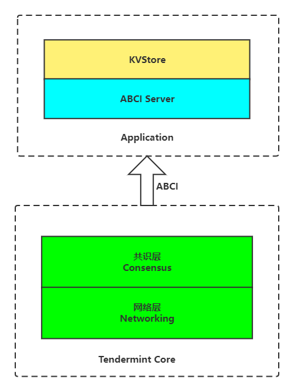
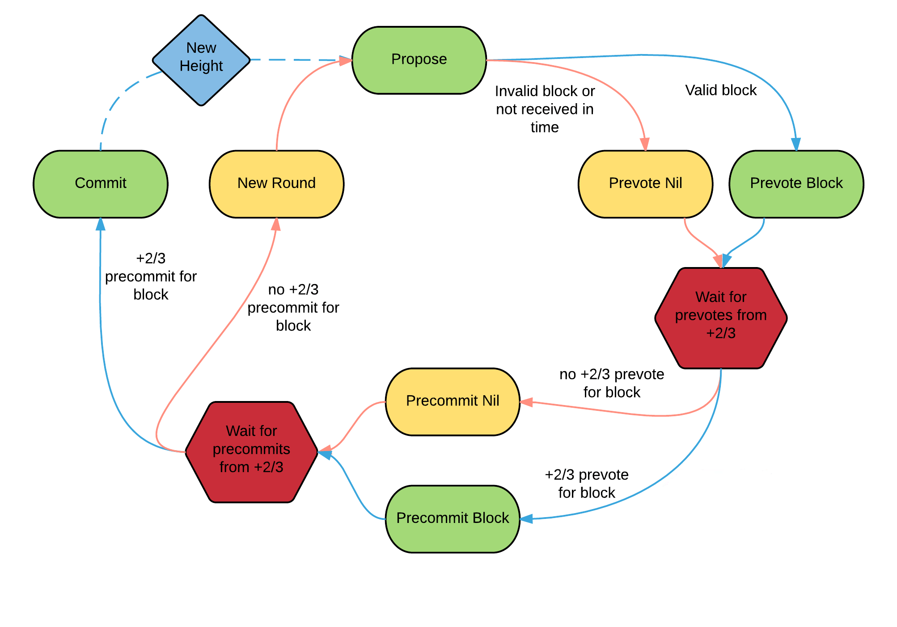

# Tendermint实践

## 视频教程
* **Bilibili**
  * [01-Tendermint介绍](https://www.bilibili.com/video/BV1KV4y157PV/?spm_id_from=333.999.0.0&vd_source=79484a601afa1e7d36a00ef527669e7e)
  * [02-Tendermint以builtin方式实现KVStore App](https://www.bilibili.com/video/BV1ve411V7eE/?spm_id_from=333.999.0.0&vd_source=79484a601afa1e7d36a00ef527669e7e)
  * [03-Tendermint以external方式实现KVStore App](https://www.bilibili.com/video/BV1SM411r7ZF/?spm_id_from=333.999.0.0&vd_source=79484a601afa1e7d36a00ef527669e7e)
* **YouTube**
  * [01-Tendermint介绍](https://www.youtube.com/watch?v=IR9Lp0q4VAM&list=PL9aoThVN5PLlNNmBfXU_K2RAE6bO2xOz5&index=1)
  * [02-Tendermint以builtin方式实现KVStore App](https://www.youtube.com/watch?v=IWXnO6Z3kOE&list=PL9aoThVN5PLlNNmBfXU_K2RAE6bO2xOz5&index=2)
  * [03-Tendermint以external方式实现KVStore App](https://www.youtube.com/watch?v=VYOT3unzehk&list=PL9aoThVN5PLlNNmBfXU_K2RAE6bO2xOz5&index=3)

## 架构


## 编译
### 编译Tendermint
```
git clone git@github.com:ssuchichen/tendermint.git
cd tendermint
make build # build目录下会生成可执行文件tendermint
```
### 编译本项目
* `make all`：编译所有的子项目
* `make builtin`：编译内建形式的App
* `make external`：编译分离形式的App  
编译后的可执行程序，在`build`目录下。

## 运行
### 初始化
```
./build/tendermint init
```
### 启动
* **Builtin**
```
./build/kvstore-builtin
```
* **External**
```
./build/tendermint node
```
```
./build/kvstore-external
```
### 测试
```
curl -s 'localhost:26657/broadcast_tx_commit?tx="cdd=hello"'
curl -s 'localhost:26657/abci_query?data="cdd"'
curl -s 'localhost:26657/broadcast_tx_commit?tx="cdd=world"'
curl -s 'localhost:26657/abci_query?data="xyz"'
```

## 什么是Tendermint？
Tendermint是用于在许多机器上安全、一致地复制应用程序的软件。(Tendermint is software for securely and consistently replicating an application on many machines. )
* **安全性**  
多达1/3的机器以任意方式出现故障，Tendermint也能正常工作。
* **一致性**  
每台无故障的机器都会看到相同的事务日志并计算相同的状态。

## Tendermint组成
Tendermint由两个主要技术组件组成: 区块链共识引擎和通用应用程序接口。(Tendermint consists of two chief technical components: a blockchain consensus engine and a generic application interface. )
* **Tendermint Core**  
确保在每台机器上以相同的顺序记录相同的事务。
* **Application BlockChain Interface (ABCI)**  
允许用任何编程语言处理事务。

## Tendermint的作用
构建需要状态复制的应用，如区块链等。

## ABCI
Tendermint Core(共识引擎)通过满足ABCI协议与应用程序通信（应用程序实现了ABCI的接口）。
### 假如用Tendermint实现区块链的功能
Tendermint Core需要做:  
* 要在节点间传播区块和交易
* 建立规范(不可变)的交易顺序

Application需要做:  
* 维护存放交易的数据库
* 验证交易签名
* 防止双花
* 查询交易
### ABCI Message
* **DeliverTx**  
  区块链中每笔交易都是通过DeliverTx传递的。应用程序对于每笔收到的交易都要验证。如果合法，就更新应状态。
* **CheckTx**  
  类似于DeliverTx，但它仅用于验证交易。Tendermint Core的mempool首先使用CheckTx检查交易的合法性，并且只将合法交易传递到其他节点。
* **Commit**  
  Commit消息用于计算对当前应用程序状态的加密承诺(cryptographic commitment)，以放入下一个区块头。


## Consensus Overview


